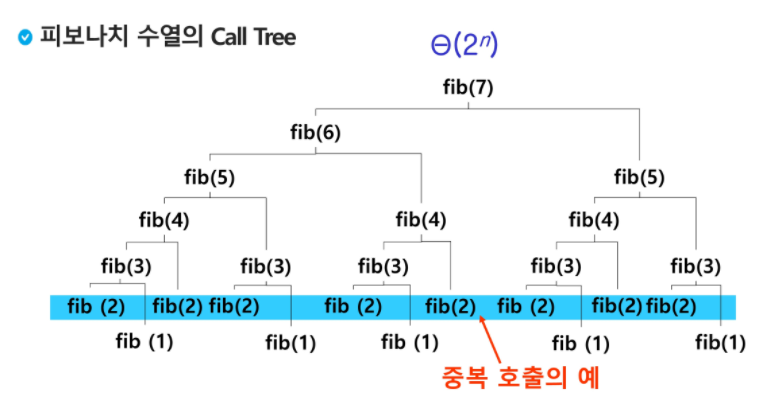

# 03-스택(Stack)

## 스택

- 물건을 쌓아 올리듯, 자료를 쌓아 올린 형태의 자료구조

- 후입선출(LIFO, Last-In-First-Out)

  ```python
  class Stack:
      def __init__(self, size):
          self.size = size
          self.items = [None] * self.size
          self.top = -1  # 없다
  
      def is_empty(self):
          return self.top == -1
  
      def is_full(self):
          return self.top == self.size - 1
  
      def push(self, item):
          if self.is_full():
              raise ValueError('Stack Overflow!')
          else:
              self.top += 1
              self.items[self.top] = item
  
      def pop(self):
          if self.is_empty():
              raise ValueError('Empty Stack. Nothing to pop.')
          else:
              item = self.items[self.top]
              self.items[self.top] = None
              self.top -= 1
              return item
  
      def peek(self):
          if self.is_empty():
              raise ValueError('Empty Stack. Nothing to peek.')
          else:
              return self.items[self.top]
  
      def __str__(self):  # print했을 때, 스택 시각화
          result = '\n-----'
          for item in self.items:
              if item is None:
                  result = f'\n|   |' + result
              else:
                  result = f'\n| {item} |' + result
          return result
  ```

  

## 재귀호출

### Memoization & DP

- 피보나치 수열의 Call Tree, 많은 중복 호출이 존재

- 

- Memoization을 적용한 피보나치 수열

  ```python
  def fibo(n):
      global memo
      if n >= 2 and len(memo) <= n:
          memo.append(fibo(n-1) + fibo(n-2))
      return memo[n]
  
  memo = [0, 1]
  ```

- DP(Dynamic Programming)를 적용한 피보나치 수열

  ```python
  def fibo(n):
      f = [0, 1]
      for i in range(2, n+1):
          f.append(f[i-1] + f[i-2])
      return f[n]
  ```

  

## DFS(Depth First Search)

- 깊이우선탐색 - 그래프와 연계

- 가장 마지막에 만났던 갈림길의 정점으로 되돌아가서 다시 깊이 우선 탐색을 반복

- 스택 사용


## 백트래킹(Backtracking)

- 근데 이제 DFS를 곁들인...
- DFS에서 조건을 걸어서 더 깊게 들어가지 않게 해 과정을 줄이는 기법

- 해를 찾는 도중에 막히면(해가 아니면) 되돌아가서 다시 해를 찾아가는 기법

  ```python
  def f(i, N, s, t, rs):  # i 부분집합에 포함될 지 결정할 원소의 인덱스, N 전체 원소 개수, t s 이전까지 찾는 부분집합의 합 값
      global cnt
      cnt += 1
      if s == t:
          for j in range(N):
              if bit[j] == 1:
                  print(a[j], end=' ')
          print()
      elif i == N:
          return
      elif s > t:
          return
      elif rs+s < t:
          return
      else:
          bit[i] = 1
          f(i + 1, N, s + a[i], t, rs-a[i])
          bit[i] = 0
          f(i + 1, N, s, t, rs-a[i])
  
      return
  
  
  N = 10
  cnt = 0
  a = [x for x in range(1, N + 1)]
  bit = [0] * N
  t = 55
  f(0, N, 0, t, sum(a))
  print(cnt)
  ```


## 분할정복 알고리즘

### 순열 구하기(부분집합)

```python
def get_subsets(idx):
    if idx == N:
        # print(result)
        print(ans)
        return
    result[idx] = True
    ans.append(numbers[idx])
    get_subsets(idx+1)
    result[idx] = False
    ans.pop()
    get_subsets(idx+1)


N = len(numbers)
result = [None] * N
ans = []

get_subsets(0)
```

```python
# 조합
def comb(check_idx, s, N, r):
    """
    :param check_idx: check에서 채울 idx => 조합할 idx
    :param s: 선택 구간의 시작점
    :param N: 전체 크기
    :param r: 조합으로 고를 갯수
    :return: 
    """

    # 다 골랐다면, 탈출!
    if check_idx == r:
        print(check)

    else:
        """
        s => 남겨진 구간의 시작 idx
        N-r => 전체 - 고를 조합 수
        N-r+check_idx => N
        """
        # for i in range(s, s+r):
        #     if i < N:
        #         check[check_idx] = numbers[i]
        #         comb(check_idx + 1, i + 1, N, r)
        for i in range(s, N-r+check_idx+1):
            check[check_idx] = numbers[i]
            comb(check_idx+1, i+1, N, r)


# 1 ~ 4 자리 수를 갖는 부분 집합 경우의 수
numbers = [1, 2, 3, 4, 5]
N = len(numbers)
for r in range(1, 5):
    check = [None] * r
    comb(0, 0, N, r)  # len(numbers) C r
```

```python
# 순서가 있는 순열
def perm(i, n):
    if i == n:
        print(*numbers[:n])
        return

    # 제자리 그대로 부터 마지막 idx까지
    for j in range(i, N):
        numbers[i], numbers[j] = numbers[j], numbers[i]
        perm(i+1, n)
        numbers[i], numbers[j] = numbers[j], numbers[i]

        
numbers = [1, 2, 3, 4, 5]
N = len(numbers)
perm(0, 3)
```


### 퀵 정렬(Quick Sort)


```python
# 이해하기 좀더 편한 ver. 
# python은 신이다.
# return에 left, right 위치를 바꿔주면 내림차순!

def quicksort(arr):
    N = len(arr)
    if N <= 1:
        return arr

    pivot = arr[0]

    left, right = [], []

    for idx in range(1, N):
        if arr[idx] > pivot:
            right.append(arr[idx])
        else:
            left.append(arr[idx])
    
    sorted_left = quicksort(left)
    sorted_right = quicksort(right)

    return [*sorted_left, pivot, *sorted_right]


numbers = [6, 2, 3, 1, 5, 4]
print(quicksort(numbers))
```


```python
# Original ver.

def quicksort(a, begin, end):
    if begin < end:
        p = partition(a, begin, end)
        quicksort(a, begin, p-1)
        quicksort(a, p+1, end)

def partition(a, begin, end):
    pivot = (begin+end) // 2
    L = begin
    R = end
    while L < R:
        while(L < R and a[L] < a[pivot]) : L += 1
        while(L < R and a[R] >= a[pivot]) : R -= 1
        if L < R:
            if L == pivot : pivot = R
            a[L], a[R] = a[R], a[L]
    a[pivot], a[R] = a[R], a[pivot]
    return R

a = [69,10,30,2,16,8,31,22]
quicksort(a, 0, len(a)-1)
print(a)
```

