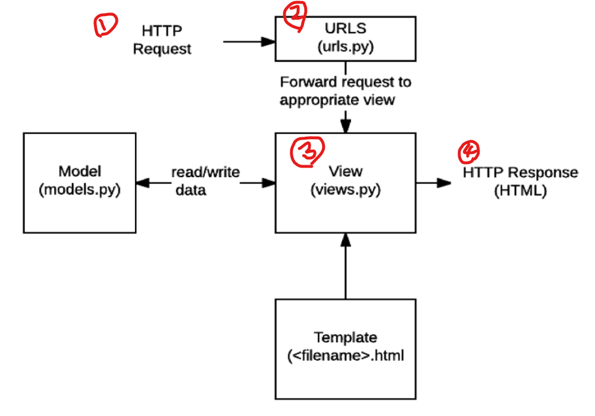

# Django

- 파이썬 웹 프레임워크

## Web Framework

- Static web page(정적 웹페이지)
  - 누가 요청을 해도 같은 응답을 보냄
  - 서버가 요청을 받을 때, 추가적인 처리 과정없이 클라이언트에게 응답을 보냄
- Dynamic web page(동적 웹페이지)
  - 조건에 따라 다른 응답을 보냄
  - 추가적인 처리과정 이후 클라이언트에게 응답을 보냄
  - 데이터베이스와의 상호작용
### Framework

  - 프로그래밍에서 특정 운영 체제를 위한 응용 프로그램 표준 구조를 구현하는 클래스와 라이브러리 모임
  - 재사용할 수 있는 많은 코드를 프레임워크를 통합함으로써, 다시 코드를 작성하지 않아도 같이 사용할 수 있도록 도움
  - Application Framework 라고도 함

=> 웹 프레임워크란, 웹 페이지를 개발하는 과정에서 겪는 어려움을 줄이는 것이 주 목적

#### Framework Architeture
  - MVC 디자인 패턴(model-view-controller)

  - Django는 MTV 패턴
    - Model
      - 응용프로그램의 데이터 구조 정의 및 데이터베이스 기록 관리
    - Template
      - 파일의 구조나 레이아웃 정의
      - 실제 내용을 보여주는데 사용
    - View
      - HTTP 요청 수신 및 반환
      - Model을 통해 요청을 충족시키는데 필요한 데이터에 접근
      - Template에 응답 서식 설정을 맡김
    
  - MTV 패턴

    

## Django Intro

### 순서

1. 가상환경 생성 및 활성화

   `$ python -m venv venv`

2. django 설치

3. 프로젝트 생성

   `$ django-admin startproject <name> .`

4. 서버켜서 로켓 확인

   `$ python manage.py runserver`

5. 앱 생성

   `$ python manage.py startapp <name>`

6. 앱 등록

## Template

- 데이터 표현을 제어하는 도구이자 표현에 관련된 로직

### Django Template Language(DTL)

- 조건, 반복, 변수 치환, 필터 등의 기능 제공
- `{{ }}`: 화면에 출력해야 하는 것
- ``: 그 외 전부

#### Variable

- `{{ variable }}`
- render()를 사용해 views.py에서 정의한 변수를 template 파일로 넘겨 사용

#### Filters

- `{{ variable|filter }}`
- 표시할 변수를 수정할 때 사용

#### Tags

- ``
- 출력 텍스트를 만들거나,반복 또는 논리를 수행하여 제어 흐름을 만드는 등 변수보다 복잡한 작업을 수행
- 일부 종료 태그가 필요
  - ` `

## HTML Form

## URL

