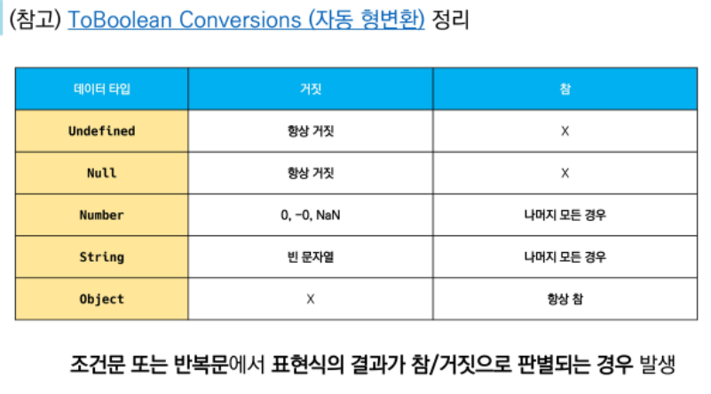

# 01

## Intro

### 브라우저(browser)

- url로 웹을 탐색하며 서버와 통신하고 html 문서나 파일을 출력하는 GUI기반의 소프트웨어

#### 브라우저에서 할 수 있는 일

- DOM(Document Object Model) 조작
  - html, xml과 같은 문서를 다루기 위한 프로그래밍 인터페이스
  - 문서가 객체로 구조화되어 있으며, key로 접근 가능
  - 파싱(parsing): 브라우저가 문자열을 해석해 DOM Tree로 만드는 과정
  - html 문서 조작
- BOM(Browser Object Model) 조작
  - 자바스크립트가 브라우저와 소통하기 위한 모델
  - window 객체는 모든 브라우저로부터 지원받으며 브라우저의 창(window)를 지칭
  - navigator, screen 등
- JavaSciprt Core (ECMAScipt)
  - 브라우저(DOM&BOM)을 조작하기 위한 명령어 약속(언어)
  - data structure 등

### JavaScript의 필요성

- 브라우저 화면을 '동적'으로 만들기 위함
- 브라우저를 조작할 수 있는 유일한 언어

### 세미콜론(semicolon)

- 쓰든 말든 상관없음
- 안써도 자동으로 ASI(자동 세미콜론 삽입 규칙)에 의해 세미콜론이 삽입됨


## 변수

- 식별자(identifier)는 변수를 구분할 수 있는 변수명을 말함
- 식별자는 반드시 문자, 달러($), 혹은 밑줄(_)로 시작
- for, if, function 등 예약어 사용 불가능

### 식별자 작성 스타일

- 카멜 케이스(camelCase) - 변수, 객체, 함수
- 파스칼 케이스(PascalCase) - 클래스, 생성자
- 대문자 스네이크 케이스(SNAKE_CASE) - 상수에 사용

### 변수 선언 키워드

- let
  - 재할당 할 예정인 변수 선언 시 사용
  - 변수 재선언 불가능
  - 블록 스코프
  - 
  - 선언 - 변수를 생성하는 행위 혹은 시점
  - 할당 - 선언된 변수에 값을 저장하는 행위 혹은 시점
  - 초기화 - 선언된 변수에 처음으로 값을 저장하는 행위 혹은 시점
- const
  - 재할당 할 예정이 없는 변수 선언 시 사용
  - 변수 재선언 불가능
  - 블록 스코프

#### let vs const

- 일단 const 써~
- 생각보다 재할당하는 경우가 거~의 없다.


## 데이터 타입

### 원시 타입(Primitive type)

- 숫자(Number) 타입
  - 파이썬과 동일하나, 무한 값이 존재 => `1/0 = Infinity`
  - 계산 불가능한 경우, `NaN`반환
- 문자열(String)
  - 따옴표로 구분
  - 파이썬에서 `f'{firstname}'`
    - 자바스크립트에서는 백틱을 사용 => \`${firstname}`
- undefined
  - 변수의 값이 없음을 나타내는 타입
  - 변수 선언 이후 직접 값을 할당하지 않으면 자동으로 할당
- null
  - 변수의 값이 없음을 의도적으로 표현할 때 나타내는 타입
- Boolean
  - true, false (소문자)




### 참조 타입(Reference type)

- 함수
- 배열
- 객체


## 연산자

### 할당 연산자

- +, -, *, / 가능
- += 이런것도 가능
- 그 외, ++ 1더하기, -- 1빼기

### 비교 연산자

- 피연산자들을 비교하고 결과값을 boolean으로 반환하는 연산자
- 문자열도 가능
  - 유니코드 값을 사용 => 후순위, 소문자가 더 큼
- 동등 비교 연산자(==)
  - 안씀 (1=='1' => true나옴)
- 그래서 일치 비교 연산자(===) 씀
  - (1==='1' => false)

### 논리 연산자

- and: &&
- or: ||
- not: !

### 삼항 연산자

```javascript
let x = 2 < 1  // false
x ? 1 : 2  	   // 2
```


## 조건/반복

### 조건문

#### if

```javascript
if (condition) {
    // do something
} else if (condition) {
    // do something
} else {
    // do something
}
```


#### switch

- 표현식의 결과값을 이용한 조건문
- 표현식의 결과값과 case문의 오른쪽 값을 비교
- break가 없는 경우, break를 만나거나 혹은 default를 실행할 때까지 다음 조건문 실행

```javascript
switch (nation) {
    case 'Korea': {
        console.log('안녕')
        break
    }
    case 'France': {
        console.log('봉주루')
        break
    }
    default: {
        console.log('몰라')
    }
}
```


### 반복문

#### while

```javascript
let i = 0
while (i < 6) {
    console.log(i)
    i += 1 // i ++
}
// 0, 1, 2, 3, 4, 5
```


#### for

```javascript
for (initialization; condition; expression) {
    // do something
}
```

- 세미콜론(;)으로 구분되는 세 부분
- initialization
  - 최초 반복문 진입 시 1회만 실행되는 부분
- condition
  - 매 반복 시행 전 평가되는 부분
- expression
  - 매 반복 시행 이후 평가되는 부분

```javascript
for (let i=0; i<6; i++) {
    console.log(i)
}
```


#### for ... in

```javascript
for (variable in object) {
    // do something
}
```

- 객체(object)의 속성(key)들을 순회할 때 사용, for ... in에서 객체는 딕셔너리
- 따라서, 배열에서 사용하지 않음


#### for ... of

```javascript
for (variable of iterables) {
    // do something
}
```

- 반복 가능한(iterable) 객체를 순회하며 값을 꺼낼 때 사용

```javascript
const fruits = ['딸기', '바나나', '메롱']
for (let fruit of fruits) {
    fruit = fruit + '!'
    console.log(fruit)
}
```

- 이때 in을 쓰면, 인덱스가 출력됨


## 함수


## 배열, 객체


## this


