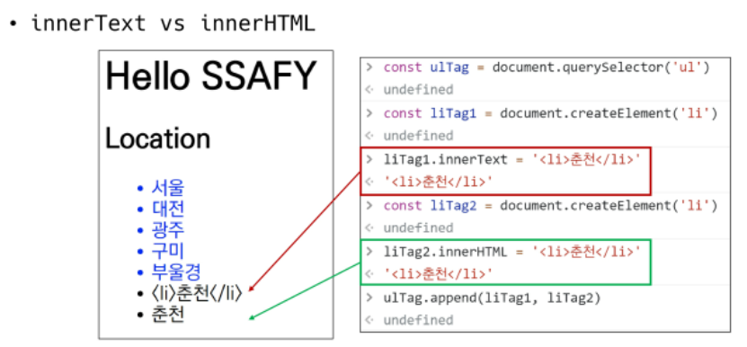

# 02

## DOM

### DOM 조작

- Document는 문자 한 장(HTML)에 해당하고 이를 조작
  - 선택(Select)
  - 변경(Manipulation)

### 상속 구조

- EventTarget
  
  Event Listener를 가질 수 있는 객체가 구현하는 DOM 인터페이스
  
  - Node
  
    여러 DOM 타입들이 상속하는 인터페이스
  
    - Element
  
      Document 안의 모든 객체가 상속하는 가장 범용적인 인터페이스 
  
      부모인 Node와 그 부모인 EventTarget의 속성을 상속
  
    - Document
  
      브라우저가 불러온 웹 페이지를 나타냄
  
      DOM 트리의 진입점(entry point) 역할을 수행
  
      - HTMLElement
  
        모든 종류의 HTML 요소
  
        부모 element의 속성 상속

### DOM 선택 메소드

- `document.querySelector(selector)`
  - 제공한 선택자와 일치하는 element 하나 선택
  - 제공한 CSS selector를 만족하는 첫 번째 element 객체를 반환(없으면 null)
- `document.querySelectorAll(selector)`
  - 제공한 선택자와 일치하는 여러 element를 선택
  - 매칭할 하나 이상의 셀렉터를 포함하는 유효한 CSS selector를 인자(문자열)로 받음
  - 지정한 셀렉터에 일치하는 NodeList를 반환
- `getElementById(), getElementTagName()` 말고 위 메소드를 쓰는 이유
  - id, class, tag 선택자 등을 모두 사용 가능하므로, 더 구체적이고 유연한 선택이 가능
  - id => `'#id'`
  - class => `'.class'`


### DOM 변경 메소드

- `document.createElement()`
  - 작성한 태그 명의 HTML 요소를 생성해 반환
- `Element.append()`
  - 특정 부모 Node의 자식 NodeList 중 마지막 자식 다음에 Node객체나 DOMString 삽입
  - 여러 개 추가할 수 있음
  - 반환 값 없음
- `Node.appendChild()`
  - 한 Node를 특정 부모 Node의 자식 NodeList 중 마지막 자식으로 삽입(Node만 가능)
  - 하나만 가능
  - 만약 주어진 Node가 이미 문서에 존재하는 다른 Node를 참조한다면 새로운 위치로 이동
  - 추가한 Node 객체를 반환

### DOM 변경 속성

- `Node.innerText`
  - Node 객체와 그 자손의 텍스트 컨텐츠(DOMString)를 표현
  - 즉, 줄 바꿈을 인식하고 숨겨진 내용을 무시하는 등 최종적으로 스타일링이 적용된 모습으로 표현
  
- `Element.innerHTML`
  - 요소 내에 포함된 HTML 마크업을 반환
  - XSS 공격에 취약하므로 사용 x
  
  - *cf) XSS(Cross-site Scripting)*
    - 공격자가 입력요소를 사용하여(\<input>)웹 사이트 클라이언트 측 코드에 악성 스크립트를 삽입해 공격하는 방법
    - 피해자(사용자)의 브라우저가 악성 스크립트를 실행하며 공격자가 엑세스 제어를 우회하고 사용자를 가장할 수 있도록 함
  
- 

### DOM 삭제 메소드

- `childNode.remove()`
  - Node가 속한 트리에서 해당 Node를 제거
- `Node.removeChild()`
  - DOM에서 자식 Node를 제거하고 제거된 Node를 반환
  - Node는 인자로 들어가는 자식 Node의 부모 Node

### DOM 속성 메소드

- `Element.setAttribute(name, value)`
  - 지정된 요소의 값을 설정
  - 속성이 이미 존재하면 갱신, 존재하지 않으면 지정된 이름과 값으로 새 속성을 추가
- `Element.getAttribute(attributeName)`
  - 해당 요소의 지정된 값(문자열)을 반환
  - 인자는 값을 얻고자 하는 속성의 이름

```js
// 실습1

<body>
  <a id="anchor" href="">GOOGLE</a>

  <script>

    /*
      JavaScript 코드만을 활용하여 a#anchor 요소를 아래와 같이 수정합니다.
        1) a 태그에 text-decoration-none 클래스를 추가합니다.
        2) a 태그의 href 속성은 https://google.com/ 입니다.
        3) a 태그의 target 속성은 _blank 입니다. (새 탭에서 열기)
    */

    const anchor = document.querySelector('#anchor')

    anchor.classList.add('text-decoration-none')
    anchor.href = 'https://google.com/'
    anchor.target = '_blank'
	
	// 위와 동일한 결과
    // anchor.setAttribute('class', 'text-decoration-none')
    // anchor.setAttribute('href', 'https://google.com/')
    // anchor.setAttribute('target', '_blank')

  </script>
</body>
```


```js
// 실습2

<body>

  <div id="app"></div>

  <script>
    // div#app 요소 선택
    const app = document.querySelector('#app')
    
    // h1 태그를 createElement 로 생성
    const h1 = document.createElement('h1')

    // 생성한 h1태그의 내용을 '오늘의 Todo' 로 설정
    h1.innerText = '오늘의 Todo'

    // ul, li 태그들을 생성 및 내용 추가
    const ul = document.createElement('ul')

    const mLst = ['양치하기', '공부하기', '휴식하기']
    mLst.forEach(message => {
      const li = document.createElement('li')
      li.innerText = message
      ul.append(li)
    })

	// 각 태그들을 적절하기 div#app 요소에 자식요소로 추가. (#app > ul > li)
    app.append(h1, ul)

  </script>
</body>

</html>
```


## Event Listener

- 이벤트란?
  - 네트워크 활동이나 사용자와의 상호작용같은 사건의 발생을 알리기 위한 객체
  - 이벤트 발생?
    - 마우스를 클릭하거나 키보드를 누르는 등, 사용자 행동으로 발생할 수 있음
    - 특정 메소드를 호출(`Element.click()`)하여 프로그래밍적으로도 만들어낼 수 있음

- ~ 하면, ~ 한다.

  => 특정 이벤트가 **발생**하면, 할 일을 **등록**한다.

- 함수 === 일의 단위

### Event handler

- `EventTarget.addEventListener()`
  - 지정한 이벤트가 대상에 전달될 때마다 호출할 함수를 설정
  - 이벤트를 지원하는 모든 객체를 대상으로 지정 가능

```js
<body>
  <!-- 1. onclick -->
  <button onclick="alertMessage()">나를 눌러봐!</button>

  <!-- 2-1. addEventListener -->
  <button id="my-button">나를 눌러봐2!!</button>
  <hr>

	<!-- 2-2. addEventListener -->
  <p id="my-paragraph"></p>

  <form action="#">
    <label for="my-text-input">내용을 입력하세요.</label>
    <input id="my-text-input" type="text">
  </form>
  <hr>

  <!-- 2-3. addEventListener -->
  <h2>Change My Color</h2>
  <label for="change-color-input">원하는 색상을 영어로 입력하세요.</label>
  <input id="change-color-input"></input>
  <hr>

  <script>
    // 1
    const alertMessage = function () {
      alert('메롱!!!')
    }

    // 2-1
    const myButton = document.querySelector('#my-button')
    myButton.addEventListener('click', alertMessage)

    // 2-2
    const myTextInput = document.querySelector('#my-text-input')

    myTextInput.addEventListener('input', event => {
      const myPara = document.querySelector('#my-paragraph')
      myPara.innerText = event.target.value
    })  

    // 2-3
    const colorInput = document.querySelector('#change-color-input')
    const myColor = document.querySelector('h2')

    colorInput.addEventListener('input', event => myColor.style.color = event.target.value)

  </script>
</body>
```


- `event.preventDefault()`
  - 현재 이벤트의 기본 동작을 중단
  - HTML 요소의 기본 동작을 작동하지 않게 막음
    - a태그 링크 이동, form태그 데이터 전송 등
  - 이벤트를 취소할 수 있는 경우, 이벤트의 전파를 막지 않고 그 이벤트를 취소

```js
<body>
  <!-- 1. checkbox -->
  <input type="checkbox" id="my-checkbox">
  <hr>

  <!-- 2. submit -->
  <form action="/articles/" id="my-form">
    <input type="text">
    <input type="submit" value="제출!">
  </form>
  <hr>

  <!-- 3. link -->
  <a href="https://google.com/" target="_blank" id="my-link">GoToGoogle</a>
  <hr>
  
  <script>
    // 1
    const checkBox = document.querySelector('#my-checkbox')
    
    checkBox.addEventListener('click', function (event) {
      event.preventDefault()
      console.log(event)
    })

    // 2
    const formTag = document.querySelector('#my-form')

    formTag.addEventListener('submit', function (event) {
      console.log(event)
      event.preventDefault()
      event.target.reset()
    })

    // 3
    const aTag = document.querySelector('#my-link')

    aTag.addEventListener('click', function (event) {
      console.log(event)
      event.preventDefault()
    })

    // 4
    document.addEventListener('scroll', function (event) {
      console.log(event)
      event.preventDefault()
    })

  </script>
</body>
```

